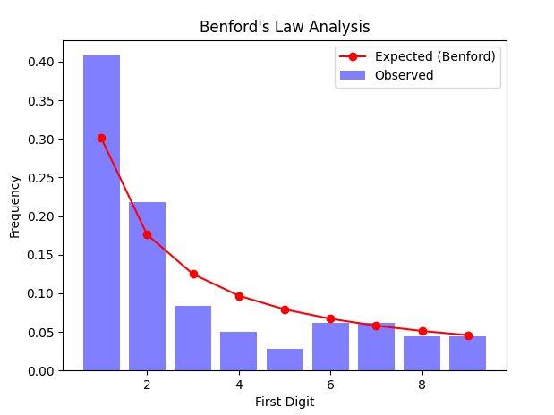

# benford's law

some cool thing chatgpt told me about lol
 
 
basically in naturally occurring datasets, it is more likely for the beginning digit of a number to be smaller (1) than bigger (9) or something like that lol don't ask me
 
 
anyways i ~~chatgpt'd~~ totally legitimately wrote all of this code myself!!!! :D
 
 

 
wowowowowowow look at that GRAPH! it's so COOL! (not really)
