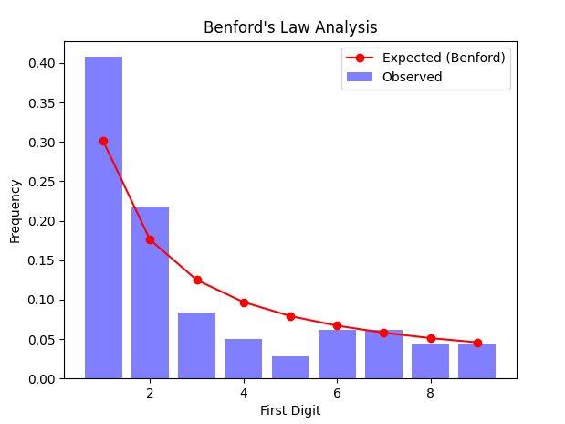

# benford's law

some cool thing chatgpt told me about lol

  
wowowowowowow look at that GRAPH! it's so COOL! (not really)

---

## 💡 overview

funny `matplotlib` graph that uses a real dataset to show benford's law in action!!!  
what is benford's law? basically, in naturally occurring datasets, it is more likely for the beginning digit of a number to be smaller (1) than bigger (9) or something like that lol don't ask me  
anyways i ~~chatgpt'd~~ totally legitimately wrote all of this code myself!!!! :D

---

## ⚙️ features

- cool graph
- cool datset
- uhh... i really don't know what else to write this time, sorry

---

## 🧰 requirements

install with:

```bash
pip install -r requirements.txt
```

## 🚀 how to use

```bash
python main.py
```
