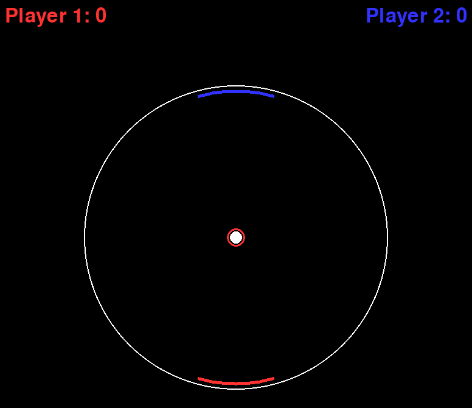

# circular pong

what if pong was a circle... i dunno



---

## 💡 overview

get this okay? what if you had pong... BUT... the arena was a CIRCLE? 🤯  
i know, i know... forbes worthy  

---

## ⚙️ features

- circular pong
- ai paddles
- scoring system (no win condition though, endless means endless fun!!!)

---

## 🧰 requirements

install with:

```bash
pip install -r requirements.txt
```

---

## 🚀 how to use

```bash
python main.py
```
