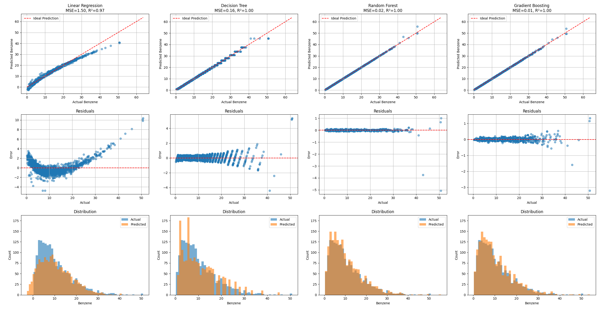

# benzene predictor

predicts amount of benzene in the air using ML models



---

## 💡 overview

uh i kind of already wrote it in the top there so... um... how was your day?  
i personally found the end product really cool to look at, maybe i should hang it up

---

## ⚙️ features

- prediction of benzene levels
- comparison of ML models
- um yeah

---

## 🧰 requirements

install with:

```bash
pip install -r requirements.txt
```

---

## 🚀 how to use

```bash
python main.py
```
