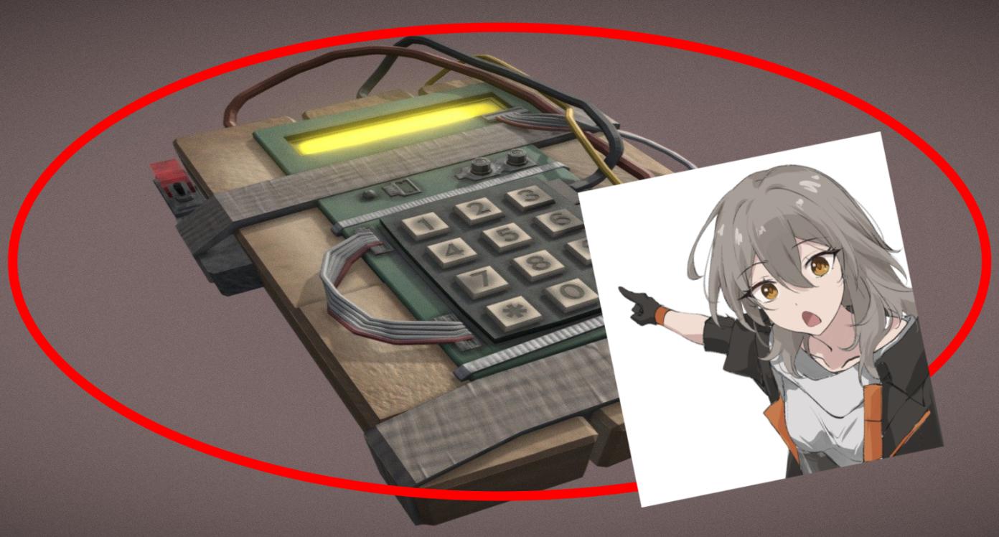

# defusal automation program

i made this for some obscure game about defusing bombs



---

## 💡 overview

doodad that automates repetitive calculations so that i can be lazy and win easily 😎  
i wonder what the game is... (it's a roblox game)  
i know the imports are an abomination (the whole program is basically one big amalgamation), but uh... let's not talk about it alright?

---

## ⚙️ features

- automates repetitive operations
- validates user input
- error handling

---

## 🚀 how to use

```bash
python main.py
```
