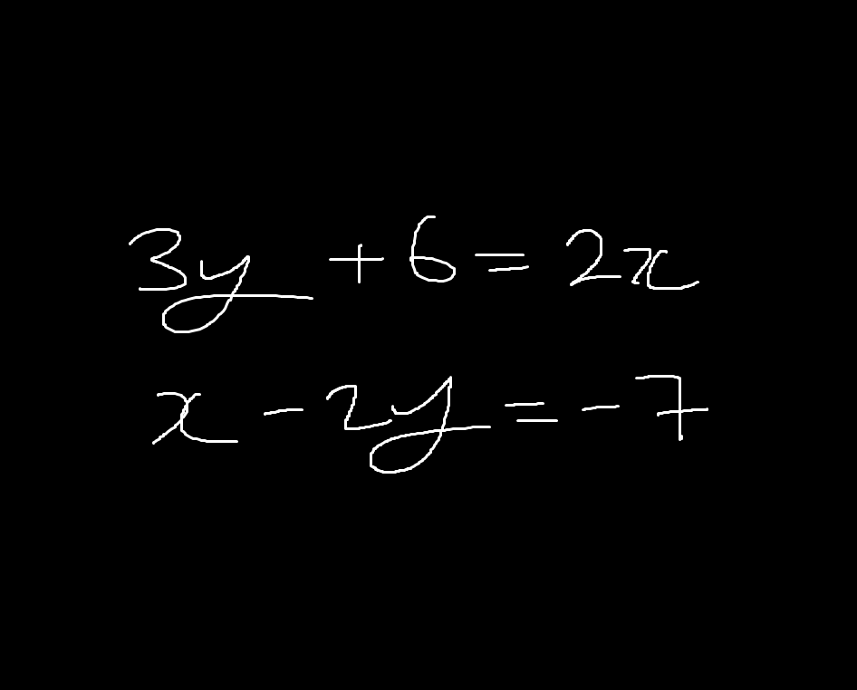

# linear system solver

so... whatchu think about simultaneous equations eh?



---

## 💡 overview

simple thingamajig that solves linear systems in the form `ax = b` using numpy  
got the idea after hearing about `numpy.linalg` and so i figured why not  
writing input validation for this made me angry, skill issue? probably, but i don't wanna hear it!

---

## ⚙️ features

- solves simultaneous equations
- validates user input
- error handling

---

## 🧰 requirements

install with:

```bash
pip install -r requirements.txt
```

---

## 🚀 how to use

```bash
python main.py
```
