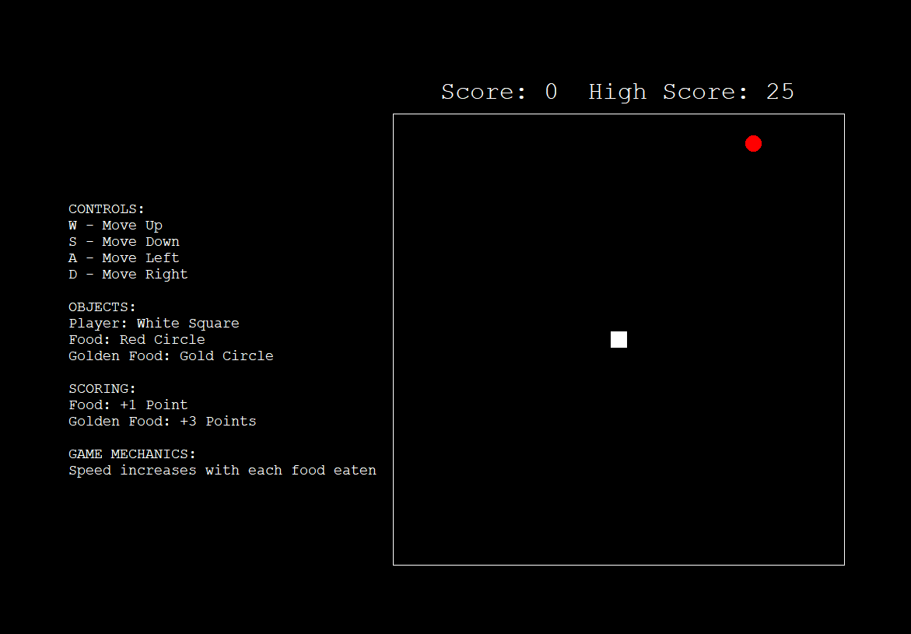

# snake game

uuhhh snake game for school open house

  
very minimalist, very demure, very mindful

---

## 💡 overview

snake game using `pyturtle` (I SHOULD HAVE JUST USED `pygame`!!!)  
i wrote comments because i'm definitely gonna forget what any of my code means and i don't wanna waste time tryna figure out what it means when something inevitably breaks because this code is abhorrent (joke... or is it...?)  
^ ignore that ramble above, that was written a year ago and CANNOT BE TRUSTED!

---

## ⚙️ features

- snake game
- small twists
- score saving

---

## 🚀 how to use

```bash
python main.py
```
