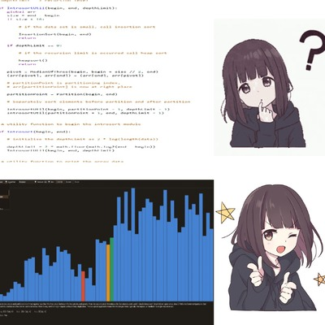

# sorting algorithm visualiser

A sorting algorithm visualiser with a bit more modern UI/UX.

## Overview

Visualises 30+ sorting algorithms, from the classics to the purposefully awful. Includes expected algorithms such as Bubble Sort, Quick Sort, and Heap Sort, alongside the less serious such as Miracle Sort, Intelligent Design Sort, and Bogobogo Sort.

Controls for swapping algorithms, datasets, and sizes before running, and adjustable speed and step-by-step execution.

I understood the algorithms better than converting them to generators if I have to be honest. More algorithms considered but put on hold because I've spent way too much time on this project.

## Features

- 30+ sorting algorithms, including several variants (e.g. Dual-Pivot Quick Sort)
- Different dataset types and sizes
- Visualisation speed control
- Run, stop, and step through execution
- Keyboard shortcuts for some controls

## Usage

Windows:

~~~bash
start.bat
~~~

Cross-platform:

~~~bash
python -u main.py
~~~
