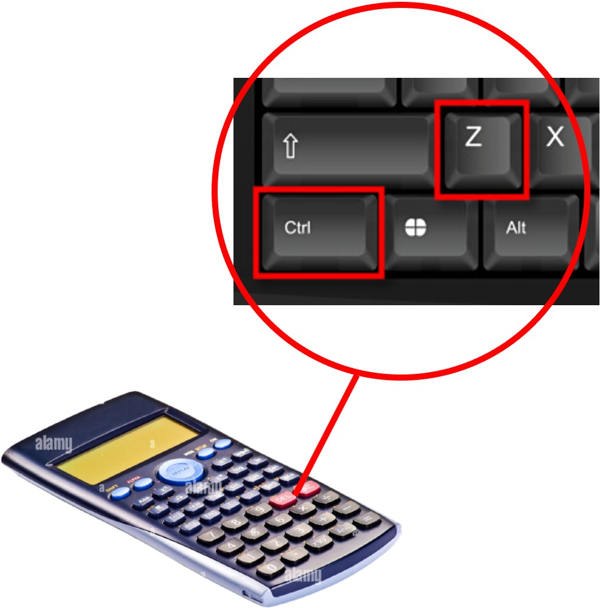

# uncalculator

Given an integer, generates an equation whose left-hand side evaluates to the input number.



## Overview

Accepts an integer and randomly generates an equation whose left-hand side evaluates to the input integer. Generation can be controlled via a random seed.

This project turned out to be more complex than I initially expected. As of writing (`3/3/2026, 3:48 AM`), only arithmetic expressions have been fully implemented. I plan to implement algebra, calculus, and maybe trigonometry in the future.

Many adjustments to the project's scope were necessary. In particular, revising from allowing multi-domain expressions to only single-domain expressions, and rejecting floats entirely.

In hindsight though, for the former, this may make outputs more meaningful rather than mashing them together, and some domains (such as calculus and trigonometry) already have some mixing, so I consider this to be a fair tradeoff. For the latter, the main gimmick of this project is to generate expressions, and floats cause much more headaches than it's worth. Besides, I think people would inherently input integers more than they would a float like "17.644921".

Apologies for the messy writing, this project has been more of a nightmare than a nice break.

## Features

- Accepts an integer and generates an equation that evaluates to it
- Option to choose between domains (currently only arithmetic; algebra and calculus planned)

## Usage

Windows:

```bash
start.bat
```

Cross-platform:

```bash
python -u main.py
```

Example:

```txt
Input: 67
Output: (((17 - 11) - ((∛(8000)) ÷ (12 - 7))) × (((√(4)) ÷ (1 + 1)) + ((5 + 7) - (√(121))))) + (95 - 32) = 67
```
