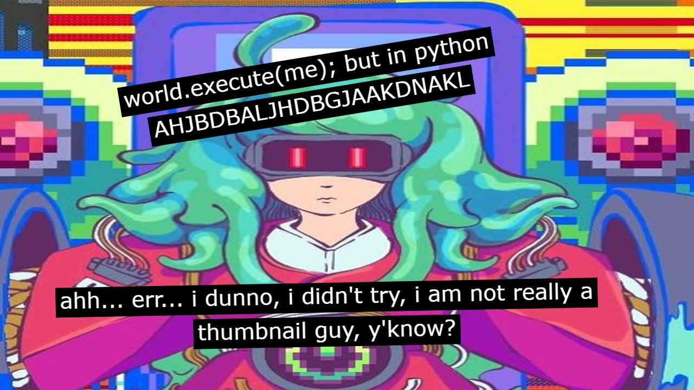

# world_execute_me

hrrrggg grrr turned song into little funny program that sync lyric and audio and then funny yippee visuals!!!



---

little doodad that plays the song `world.execute(me);` by Mili  
original idea by AlipDotPY  
video link: <https://youtu.be/hNVqVtm_sKU>

---

## ⚙️ features

- plays song
- synced lyrics
- funny visuals

---

## 🧰 requirements

install with:

```bash
pip install -r requirements.txt
```

---

## 🚀 how to use

```bash
python -u main.py
```
