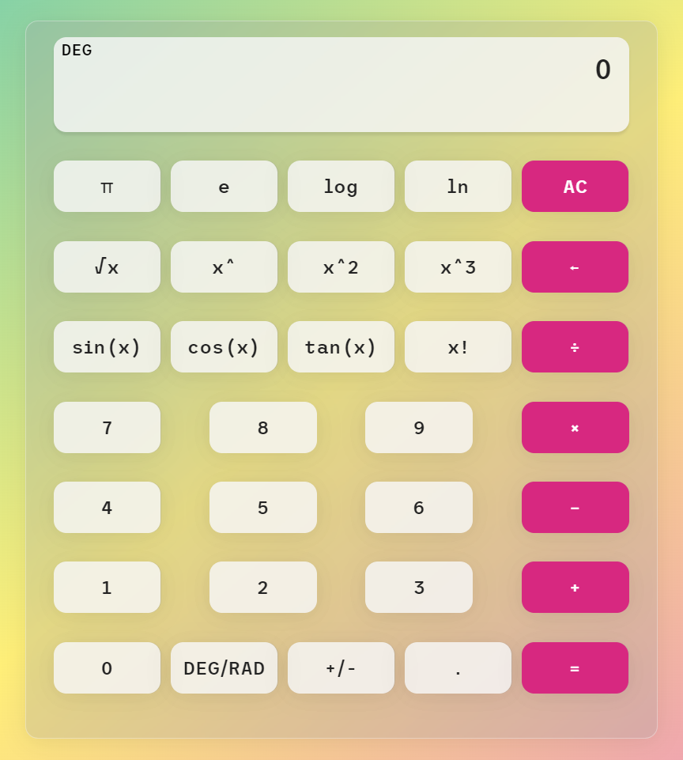

# calculator

a calculator from a tutorial, i added some other doodads though
 
uses HTML, CSS and JS
 
 
tutorial i used:
 
<https://www.youtube.com/watch?v=sBJmRD7kNTk>
 
 
an image of the calculator:
 

