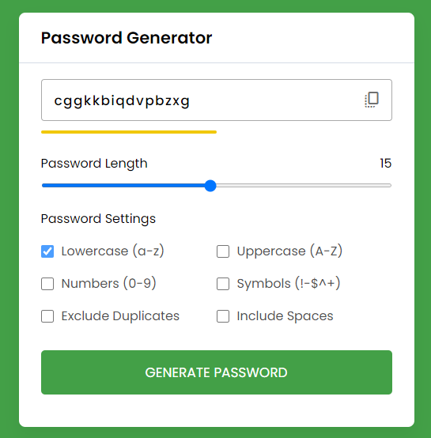

# password generator

a password generator with a few options
 
 
made from a tutorial with some error handling and minor adjustment to the length of the container thingy
 
 
made with HTML, CSS and JS
 
 
tutorial i used:
 
<https://www.youtube.com/watch?v=825u2Puaej0>
 
 
an image of the password generator:
 

