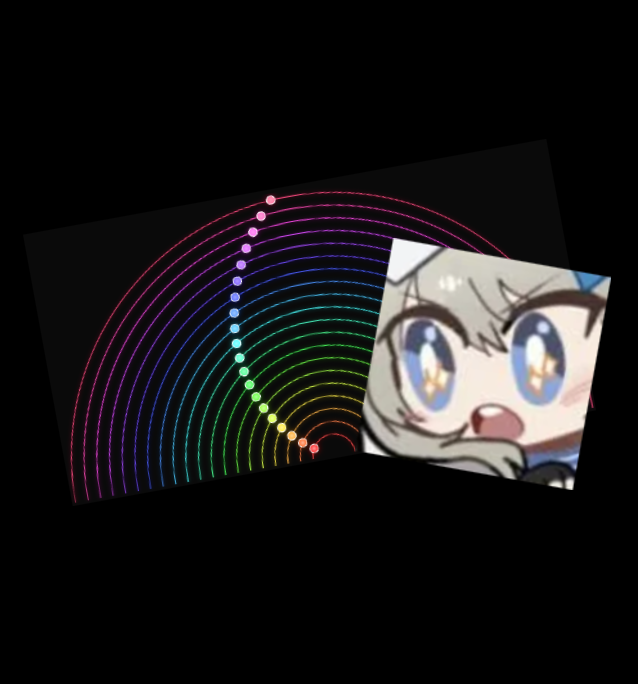

# polyrhythm simulator

A polyrhythm simulator with adjustable base frequency, oscillator, and track shape.

  

## Overview

The foundation came from [this tutorial](https://www.youtube.com/watch?v=eX-ODcr3XJg), though I added additional settings on top.

Supports semi-circle and full circle track shapes (though I can't tell if the full circle actually works as intended), adjustable base frequency, and oscillator options.

## Features

- Adjustable base frequency
- Oscillator options
- Track shape selection (semi-circle, full circle)
