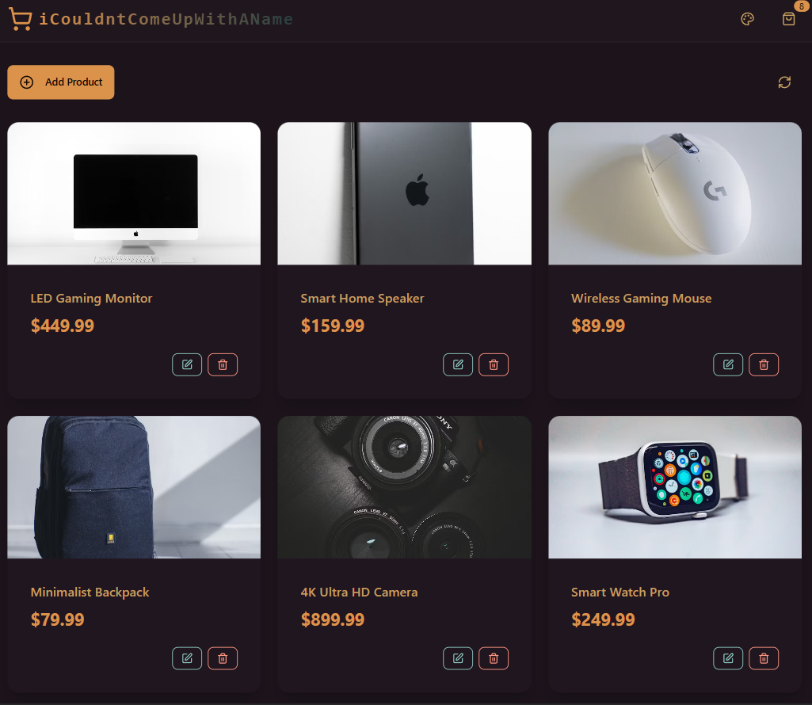

# product store

some kinda full-stack product store thing

---

## 💡 overview

some like website/app/whatever product store using PERN stack  
i thought it'd be fun to try new technologies... it was not, i don't know what's happening

- backend: Express + PostgreSQL (via Neon)
- frontend: React + Vite + TailwindCSS
- extras: Arcjet

anyways, super helpful tutorial... i already have other ideas to expand on it but for now i need a break lol  
link: <https://www.youtube.com/watch?v=lx3YJj0nJVk>

---

## ⚙️ features

- RESTful API for products
- React UI shenanigans
- rate limiting and bot shielding with Arcjet
- deployed-ready with frontend build served by backend
- Zustand for state management
- styled with TailwindCSS
