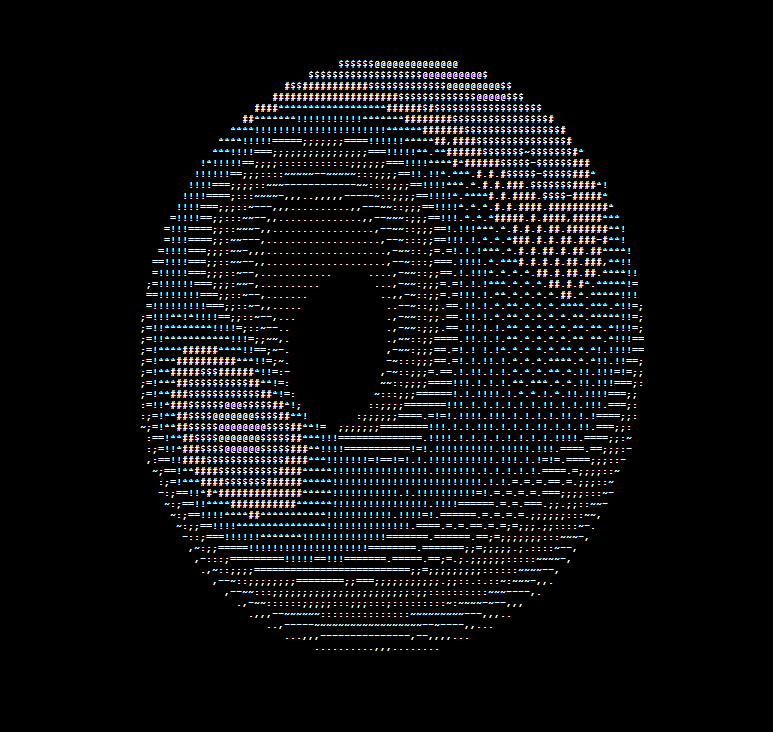

# rotating ASCII donut

rotating ASCII donut made from tutorial, the math and logic behind it is pretty cool but i don't understand
 
 
made with HTML, CSS, JS
 
 
tutorial used:
 
<https://www.youtube.com/watch?v=gBdXDs6Xo0E>
 
 
image of the donut:
 

