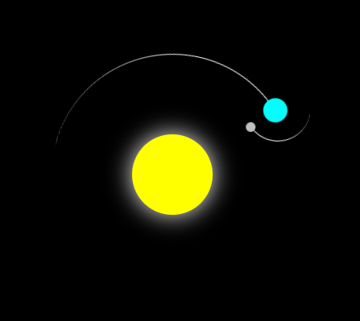

# solar system

just a simple little solar system from a tutorial i used because i thought it was cool
 
made with HTML and CSS
 
 
tutorial i used:
 
<https://www.youtube.com/shorts/LOSCrYq0ZB4>
 
 
an image of the solar system:
 

