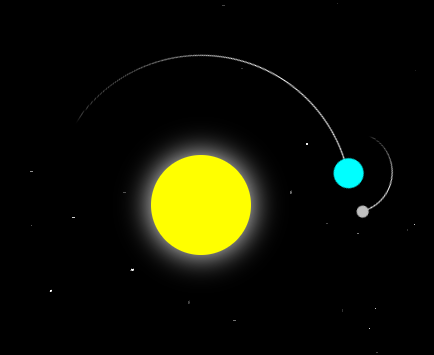

# solar system

can we pretend that airplanes in the night sky are like shooting stars

---

## 💡 overview

simple solar system...  
tutorial yup, edited though so hey, that counts for something okay?!  
link: <https://www.youtube.com/shorts/LOSCrYq0ZB4>

---

## ⚙️ features

- orbit
- yeah that's pretty much it
